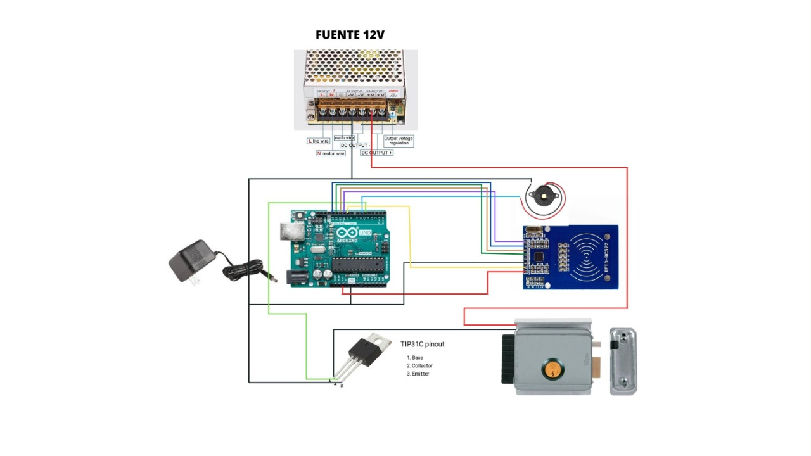

# 6.-Cerradura-inteligente

### **Descripición del proyecto**
Este proyecto trata de una cerradura inteligente la cual permite el paso, dependiendo si la tarjeta que se presenta en el sensor RFID está guardada en el sistema y en caso de no estar registrada se activa una buzzer como alarma indicando que un posible intruso se encuentra intentado pasar por la cerradura inteligente. 

### **Componentes usados y precios**
> Arduino UNO           15$
> 
> Kit RFID RC522        5$
> 
> Jumpers               1$
> 
> Buzzer                0.5$
> 
> Cerradura electrica   10$
> 
> Fuente DC 12V         4$

### **Secciones del proyecto**
1. **Lectura RFID**: En esta parte el sensor RFID RC522 lee las tarjetas cuando se las acerca al sensor para luego hacer la verificación con la base de datos del sistema.
2. **Acceso Arduino**: En esta seccion viene la programación en Arduino, donde se tiene toda la logica detrás del proyecto que compara la lectura del RFID con los códigos de las tarjetas preestablecidas, en la base de datos.
3. **Acceso Concedido**: Si el código de la tarjeta leida por el sensor es igual a un código en el sistema se presenta esta sección, dando como salida la activación del transistor y de la cerradura. 
4. **Acceso denegado**: Si el código de la tarjeta leida por el sensor no es igual a un código en el sistema se presenta esta sección, dando como salida la activación de ub buzzer a modo de alarma, indicando que hay un posible intruso y que la tarjeta no se encuentra en la base de datos. 

### **Implemetación**
1. Se programa el Arduino de tal forma que sea capaz de leer tarjetas mediante el sensor RFID, se compara dicha lectura con los códigos de las tarjetas registradas y se crea las salidas, activación de la cerradura o del buzzer(alarma), según el caso que se presente, si la tarjeta está o no en el sistema.
2. Se busca el datasheet del módulo RFID RC522 para realizar las conexiones al arduino.
3. Se consiguió todos los materiales adecuados para la implementación
4. Se conecta cada parte siguiendo como guía al diagrama esquemático.
5. Finalmente probamos que se cumpla con las funcionalidades establecidas.

### **Fallos y consideraciones**
- El sensor no interpretará a las tarjetas que no tengan la capacidad de ser leidas por su código.
- Si la tarjeta se encuentra muy alejada del sensor esta puede no sea leida por el RFID.
